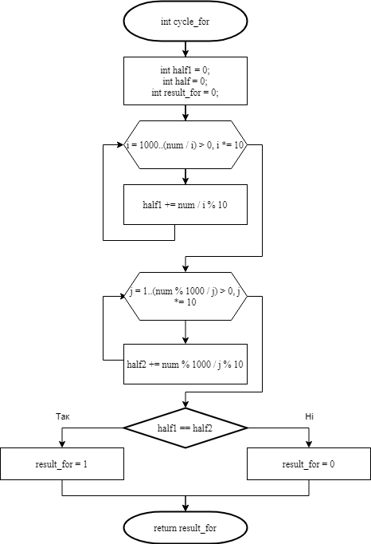

# Лабораторна робота №8. Вступ до блок-схем алгоритмів. №9. Вступ до документації коду (частина 1). №10. Вступ до локументації проекту.

## 1 Вимоги
### 1.1 Розробник
* Висоцький Олексій Васильович;
* студент групи КІТ-320;
* 13 січня 2021.

### 1.2 Загальне завдання
Переробити програми, що були розроблені під час виконання лабораторних робіт з теми «Цикли» таким чином, щоб використовувалися функції для обчислення результату.
	
### 1.3 Індивідуальне завдання
Визначити, чи є ціле 6-значне число «щасливим» квитком (сума першої половини чисел номера дорівнює сумі другої половини. Наприклад, білет з номером 102300 є щасливим, бо 1 + 0 + 2 = 3 + 0 + 0). 
	
## 2 Опис програми
### 2.1 Функціональне призначення
Програма призначена для визначення того, чи є квиток у вигляді шестизначного числа «щасливим», тобто тим, сума цифр першої половини якого дорівнює сумі цифр його другої половини.

### 2.2 Опис логічної структури
* **Основна функція**  
	`int main`  
	*Призначення*: головна функція.  
	*Схема алгоритму функції* подана на рис.1  
	*Опис роботи*: за допомогою функції rand генерує псевдовипадкове 6-значне число. Викликає функції cycle_for, cycle_while, cycle_do.
	
	
	
* **Функція перевірки білету циклом for**  
	`int cycle_for (int num)`  
	*Призначення*: визначення того, чи є білет щасливим, за допомогою циклу for.  
	*Схема алгоритму функції* подана на рис.2  
	*Опис роботи*: функція виокремлює кожну цифру 6-значного числа і обчислює суму цифр кожної половини числа. Для перевірки тотожності отриманих сум використовується оператор if.
	
	
	
* **Функція перевірки білету циклом while**  
	`int cycle_while (int num)`  
	*Призначення*: визначення того, чи є білет щасливим, за допомогою циклу while.  
	*Схема алгоритму функції* подана на рис.3  
	*Опис роботи*: функція виокремлює кожну цифру 6-значного числа і обчислює суму цифр кожної половини числа. Для перевірки тотожності отриманих сум використовується оператор if.
	
	
	
* **Функція перевірки білету циклом do_while**  
	`int cycle_do (int num)`  
	*Призначення*: визначення того, чи є білет щасливим, за допомогою циклу do_while.  
	*Схема алгоритму функції* подана на рис.4  
	*Опис роботи*: функція виокремлює кожну цифру 6-значного числа і обчислює суму цифр кожної половини числа. Для перевірки тотожності отриманих сум використовується оператор if.
	
	
	
### Структура проекту
```
   ├── lab05_task03
   │   ├── README.md
   │   └── src
   │       └── main.c
   ├── doc
   │   ├── lab07 (5_3).md
   │   └── lab07 (5_3).pdf
   ├── Makefile
   └── README.md
```
### 2.3 Важливі фрагменти програми
**Початкові дані. Константи**
```
	int num = rand() % 899999 + 100000
```

## 3 Варіанти використання
Програму можна використовувати для визначення того, чи є білет «щасливим» всіма типами циклів.
Нижче наводиться демонстрація результатів виконання програми за допомогою відлагодника “nemiver”.


	
## Висновки
При виконанні даної лабораторної роботи були освоєні навички використання функцій, які повертають або не повертають результат, задля уникнення повторів у коді.


