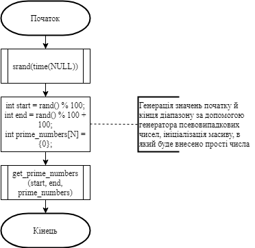
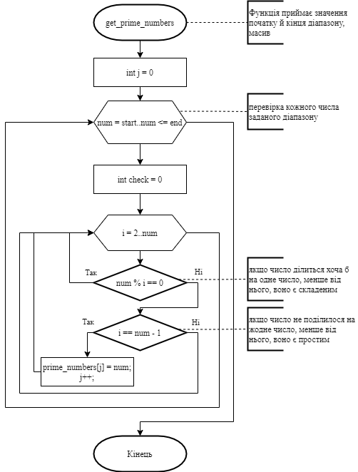
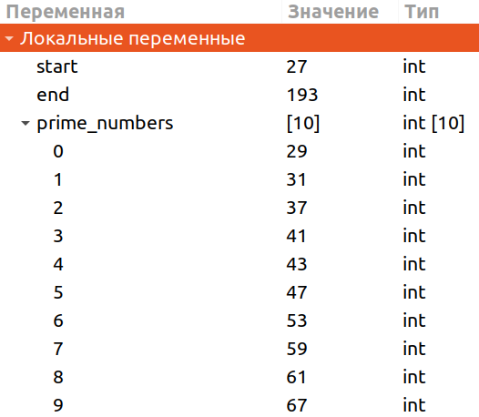

# Лабораторна робота №7. Функції

## 1 Вимоги
### 1.1 Розробник
* Висоцький Олексій Васильович;
* студент групи КІТ-320;
* 13 січня 2021.

### 1.2 Загальне завдання
Переробити програми, що були розроблені під час виконання лабораторних робіт з теми «Масиви» таким чином, щоб використовувалися функції для обчислення результату.
	
### 1.3 Індивідуальне завдання
Заповнити масив із заданої кількості елементів простими числами, що не повторюються. Розмір вихідного масиву задати наперед відомим значенням, що може бути більшим, аніж результуюча кількість отриманих елементів.
	
## 2 Опис програми
### 2.1 Функціональне призначення
Програма призначена для знаходження простих чисел у діапазоні, визначеному випадково.

### 2.2 Опис логічної структури
* **Основна функція**  
	`int main`  
	*Призначення*: головна функція.  
	*Схема алгоритму функції* подана на рис.1  
	*Опис роботи*: за допомогою функції rand генерує випадкове значення початку й кінця діапазону, у якому буде пошук простих чисел. Викликає функцію get_prime_numbers.
	
	
	
* **Функція пошуку простих чисел**  
	`void get_prime_numbers (int start, int end, int prime_numbers[])`  
	*Призначення*:: пошук простих чисел.  
	*Схема алгоритму функції* подана на рис.2  
	*Опис роботи*: функція перевіряє кожне число діапазону за допомогою циклу for: якщо число ділиться хоча б на одне число, менше від нього (крім як на одиницю), то воно є складеним, а якщо воно не ділиться на жодне число, менше від нього (крім як на одиницю), то воно є простим. Кожне знайдене просте число записується у масив, розмір якого заздалегідь задано.
	
	
	
### Структура проекту
```
.
├── doc
│   ├── assets
│   │   ├── get_prime_numbers.png
│   │   ├── main.png
│   │   └── result.png
│   ├── lab07 (6_2).docx
│   ├── lab07 (6_2).md
│   └── lab07 (6_2).pdf
├── Doxyfile
├── Makefile
├── README.md
└── src
    └── main.c

```
### 2.3 Важливі фрагменти програми
**Початкові дані. Константи**
```
#define N 15 // розмір вихідного масиву
int start = rand() % 100 // початок діапазону, заданий випадковим числом
int end = rand() % 100 + 100  // кінець діапазону, заданий випадковим числом
int prime_numbers[N] = {0} // масив простих чисел
```

## 3 Варіанти використання
Програму можна використовувати для знаходження заданої кількості простих чисел у діапазоні, визначеному випадково.
Нижче наводиться демонстрація результатів виконання програми за допомогою відлагодника “nemiver”.



## Висновки
При виконанні даної лабораторної роботи були освоєні навички використання функцій, які повертають або не повертають результат, задля уникнення повторів у коді.


