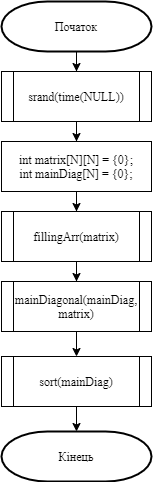
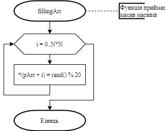
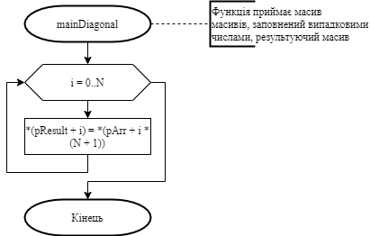
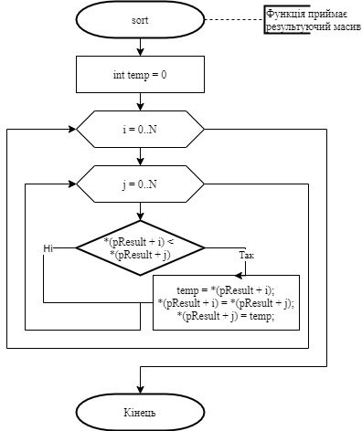
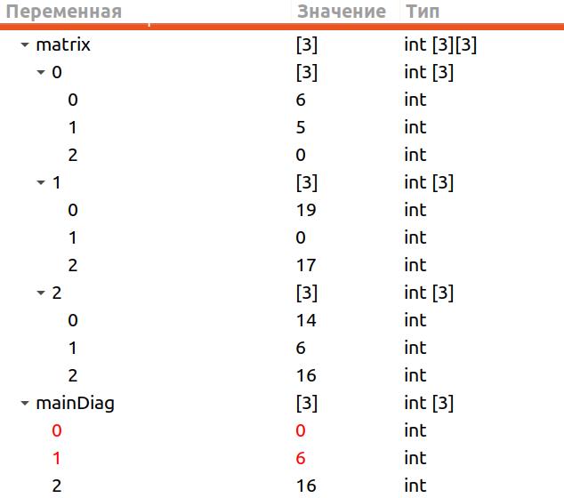

# Лабораторна робота №10. Вступ до показчиків

## 1 Вимоги
### 1.1 Розробник
* Висоцький Олексій Васильович;
* студент групи КІТ-320;
* 16 січня 2021.

### 1.2 Загальне завдання
Розробити програми, умови яких надані у лабораторному практикумі в розділі "На оцінку "добре"".
	
### 1.3 Індивідуальне завдання
Дано масив масивів з N * N цілих чисел. Елементи головної діагоналі записати в одновимірний масив, отриманий масив упорядкувати за зростанням.
	
## 2 Опис програми
### 2.1 Функціональне призначення
Програма призначена для знаходження елементів головної діагоналі матриці та упорядкування їх за зростанням.

### 2.2 Опис логічної структури
* **Основна функція**  
	`int main`  
	*Призначення*: головна функція.  
	*Схема алгоритму функції* подана на рис.1  
	*Опис роботи*: задає розмір масивам, викликає функції fillingArr, mainDiagonal, sort.
	
	
	
* **Функція заповнення вхідного масиву**  
	`void fillingArr(int *pArr)`  
	*Призначення*: заповнення вхідного масиву випадковими числами.  
	*Схема алгоритму функції* подана на рис.2  
	*Опис роботи*: функція заповнює вхідний масив випадковими числами з заданого діапазону за допомогою функції rand().
	
	

* **Функція заповнення результуючого масиву**  
	`void mainDiagonal(int *pResult, int *pArr)`  
	*Призначення*: заповнення результуючого масиву. 
	*Схема алгоритму функції* подана на рис.3  
	*Опис роботи*: функція заповнює результуючий масив елементами головної діагоналі вхідного масиву.
	
	

* **Функція сортування результуючого масиву**  
	`void sort(int *pResult)`  
	*Призначення*: сортування елементів результуючого масиву. 
	*Схема алгоритму функції* подана на рис.4  
	*Опис роботи*: функція сортує елементи результуючого масиву у порядку зростання методом бульбашки.
	
	
	
### Структура проекту
```
.
├── doc
│   ├── assets
│   │   ├── fillingArr.png
│   │   ├── mainDiagonal.png
│   │   ├── main.png
│   │   ├── result.png
│   │   └── sort.png
│   ├── lab11.docx
│   ├── lab11.md
│   └── lab11.pdf
├── Doxyfile
├── Makefile
├── README.md
├── task03
│   ├── README.md
│   └── src
│       ├── lib.c
│       ├── lib.h
│       └── main.c
└── task04
    ├── README.md
    └── src
        ├── lib.c
        ├── lib.h
        └── main.c

```
### 2.3 Важливі фрагменти програми
**Початкові дані. Константи**
```
#define N 3
```

## 3 Варіанти використання
Програму можна використовувати для визначення чисел головної діагоналі матриці та упорядкування їх за зростанням.
Нижче наводиться демонстрація результатів виконання програми за допомогою відлагодника “nemiver”.



## Висновки
При виконанні даної лабораторної роботи були освоєні навички створення програм з використанням показчиків.
