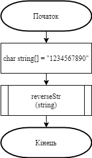
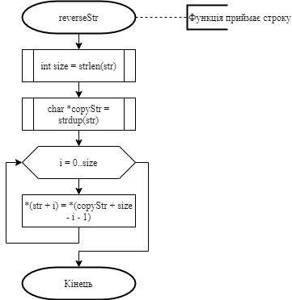
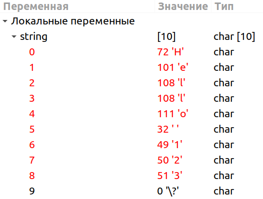
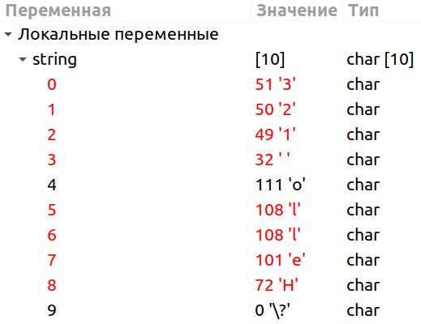

# Лабораторна робота №13. Строки (Null-terminated C Strings)

## 1 Вимоги
### 1.1 Розробник
* Висоцький Олексій Васильович;
* студент групи КІТ-320;
* 17 січня 2021.

### 1.2 Загальне завдання
Розробити програму під номером 8, умови якої надані у лабораторному практикумі в розділі "На оцінку "задовільно"".
	
## 2 Опис програми
### 2.1 Функціональне призначення
Програма призначена для зміни порядку символів тексту на протилежний.

### 2.2 Опис логічної структури
* **Основна функція**  
	`int main`  
	*Призначення*: головна функція.  
	*Схема алгоритму функції* подана на рис.1  
	*Опис роботи*: містить вхідну строку, викликає функцію reverseStr.
	
	
	
* **Функція перестановки символів рядка**  
	`void reverseStr (char *str)`  
	*Призначення*: зміна порядку символів строки на протилежний.  
	*Схема алгоритму функції* подана на рис.2  
	*Опис роботи*: визначає розмір вхідної строки за допомогою функції strlen, створює за допомогою функції strdup копію строки, елементи якої записуються у зворотному порядку у вхідний масив.
	
	

### Структура проекту
```
.
├── doc
│   ├── assets
│   │   ├── main.png
│   │   ├── result1.png
│   │   ├── result2.png
│   │   └── reverseStr.png
│   ├── lab13.docx
│   ├── lab13.md
│   └── lab13.pdf
├── Doxyfile
├── Makefile
├── README.md
└── task08
    ├── README.md
    └── src
        ├── lib.c
        ├── lib.h
        └── main.c

```

## 3 Варіанти використання
Програму можна використовувати для зміни порядку символів будь-якого тексту на протилежний.
Нижче наводиться демонстрація результатів виконання програми за допомогою відлагодника “nemiver”.





## Висновки
При виконанні даної лабораторної роботи я закріпив набуті мною навички створення програм, використовуючи функції роботи з рядками.
